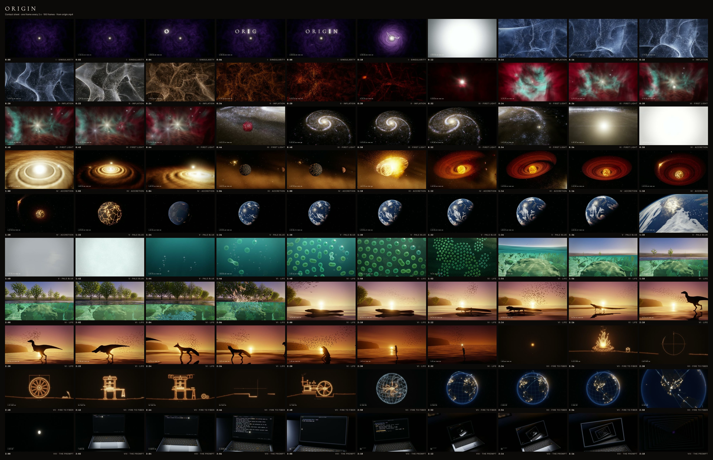
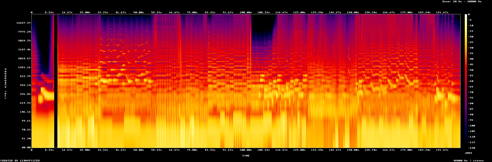

# ORIGIN: verification report

Every number below was measured from the delivered file `renders/origin.mp4` by the
scripts in `tools/verify/` (run `npm run verify`). Generated 2026-09-28T23:07:14.964Z.

## The file

```
codec_name=h264
width=1920
height=1080
pix_fmt=yuv420p
color_space=bt709
r_frame_rate=60/1
bit_rate=62942914
codec_name=aac
sample_rate=48000
channels=2
r_frame_rate=0/0
bit_rate=324379
duration=200.000000
size=1582074211
```

## Loudness (ffmpeg `-af ebur128=peak=true`, verbatim)

```
Summary:

  Integrated loudness:
    I:         -14.0 LUFS
    Threshold: -24.0 LUFS

  Loudness range:
    LRA:         3.9 LU
    Threshold: -34.0 LUFS
    LRA low:   -16.2 LUFS
    LRA high:  -12.3 LUFS

  True peak:
    Peak:       -1.5 dBFS
[out#0/null @ 0x784c68300] video:4969KiB audio:37500KiB subtitle:0KiB other streams:0KiB global headers:0KiB muxing overhead: unknown
frame=12000 fps=585 q=-0.0 Lsize=N/A time=00:03:20.00 bitrate=N/A speed=9.75x elapsed=0:00:20.50
```

Mastering report (renders/master.json, pre-AAC):
```json
{
  "lufs": -14.03,
  "truePeakDbtp": -2,
  "gainDb": 4.97,
  "wrapJump": 0.002256229519844055,
  "p99Step": 0.07383127510547638,
  "medianStep": 0.007212735712528229
}
```

## Loop seam

* Source frames `f00000.jpg` vs `f11999.jpg` byte-identical: **true**
* Decoded MP4, first vs last of 12000 frames: mean |Δ| **0**, max |Δ| **0**, PSNR **∞ (identical)**.
  The encoder checks that the last source frame is byte-identical to frame 0, then reuses frame 0's own encoded IDR access unit as the last frame.
* Audio at the wrap point (t = 200.000 → 0), mastered WAV: jump **0.00226** vs local median step 0.00257, local p99 0.00889 (**42.2th percentile** of the steps within ±0.5 s).
* Audio at the wrap point, decoded AAC from the MP4: jump **0.00248** vs local median 0.00257, local p99 0.00883 (**47.9th percentile**). The AAC is encoded circularly padded (so both edges of the loop are coded with their true neighbours and the decoder has real pre-roll), and the MP4 edit list presents exactly 200.000 s. The decoder output past sample 9,600,000 is the tail of the last AAC frame, outside the presented range.

## Hard cuts

12000 frames scanned (mean |ΔRGB| between consecutive frames at 96×54). A hard cut is an
**isolated** jump: > 6/255, > 5× the local median and > 2× both neighbouring diffs.
Isolated jumps: **46**, of which **unsanctioned: 0**.

| t | diff | local median | sanctioned by (timeline.js) |
|---|---|---|---|
| 12 | 204.68 | 2.37 | flash: bigbang |
| 14.867 | 12.74 | 2.37 | kick pulse |
| 16.3 | 11.1 | 2.13 | kick pulse |
| 17.717 | 12.85 | 2.23 | kick pulse |
| 22 | 12.25 | 2.27 | kick pulse |
| 40.367 | 11.09 | 0.49 | star birth |
| 55.617 | 14.2 | 1.5 | kick pulse |
| 56.217 | 25.48 | 1.58 | kick pulse |
| 69.383 | 50.8 | 1.54 | flash: theia |
| 102 | 101.24 | 7.49 | flash: splash |
| 114.5 | 10.22 | 1.92 | kick pulse |
| 115 | 10.43 | 1.29 | kick pulse |
| 115.5 | 10.05 | 1.01 | kick pulse |
| 116 | 10.91 | 0.91 | kick pulse |
| 116.5 | 10.63 | 0.77 | kick pulse |
| 117 | 10.83 | 0.75 | kick pulse |
| 117.5 | 10.64 | 0.77 | kick pulse |
| 118 | 9.47 | 0.77 | kick pulse |
| 118.5 | 10.19 | 0.85 | kick pulse |
| 119 | 10.38 | 0.91 | kick pulse |
| 119.5 | 11.49 | 0.91 | kick pulse |
| 120 | 9.3 | 0.91 | kick pulse |
| 120.5 | 9.45 | 0.95 | kick pulse |
| 121 | 10.35 | 0.96 | kick pulse |
| 121.5 | 10.37 | 0.97 | kick pulse |
| 122 | 10.63 | 0.98 | kick pulse |
| 122.5 | 10.57 | 1.04 | kick pulse |
| 123 | 11.34 | 1.22 | kick pulse |
| 123.5 | 9.48 | 1.84 | kick pulse |
| 155 | 6.7 | 0.6 | kick pulse |
| 155.5 | 7.52 | 0.75 | kick pulse |
| 156 | 7.2 | 1.23 | kick pulse |
| 159 | 6.47 | 0.74 | kick pulse |
| 159.5 | 6.73 | 1.04 | kick pulse |
| 160 | 7.25 | 1.37 | kick pulse |
| 162 | 9.33 | 1 | kick pulse |
| 162.5 | 6.31 | 0.79 | kick pulse |
| 163 | 10.43 | 0.62 | kick pulse |
| 163.5 | 6.3 | 0.54 | kick pulse |
| 164 | 9.99 | 0.51 | kick pulse |
| 165 | 9.82 | 0.96 | kick pulse |
| 167 | 7.3 | 1.3 | kick pulse |
| 167.5 | 7.02 | 1.39 | kick pulse |
| 168 | 6.69 | 1.2 | kick pulse |
| 168.5 | 6.58 | 1.26 | kick pulse |
| 188 | 14.33 | 1.06 | flash: enter |

Sustained high-motion runs (fast camera moves: many consecutive large diffs, not cuts):

| from | to | frames | peak diff |
|---|---|---|---|
| 12.017 | 12.133 | 8 | 23.62 |
| 64.933 | 64.95 | 2 | 17.1 |
| 156.5 | 156.5 | 1 | 7.89 |
| 165.5 | 165.5 | 1 | 8.8 |

Dropout glitches (A→B→A: up to 3 frames that jump away and then return): **0**, unsanctioned **0**.


Hand-off windows (largest frame-to-frame diff inside each window vs the median motion in the 3 s before it):

| hand-off | window (s) | max diff | at t | preceding median | hard cut |
|---|---|---|---|---|---|
| I→II | 11.96–12 | 204.68 | 12 | 0.5 | none |
| II→III | 30–33 | 5.62 | 32 | 0.75 | none |
| III→IV | 57.2–58.6 | 0.45 | 58 | 1.54 | none |
| IV→V | 81–83 | 1.05 | 81.483 | 0.67 | none |
| V→VI | 105–107 | 1.5 | 106.3 | 0.88 | none |
| VI→VII | 153–155 | 6.7 | 155 | 0.92 | none |
| VII→VIII | 179.2–180.6 | 0.7 | 180.367 | 0.98 | none |

## Sync proof (kick → visual pulse)

140/140 kicks: visual pulse within ±1 frame of the kick frame and of the measured audio onset (video 60 fps, 12000 frames).

| # | bar:beat | kick t (timeline) | audio onset (measured) | Δ audio | pulse frame (measured) | Δ vs kick frame | Δ vs audio (frames) | impulse (luma) | ok |
|---|---|---|---|---|---|---|---|---|---|
| 1 | 1:1.00 | 12.0000 | 12.001 | 1 ms | 720 | +0 | -0.03 | 204.36 | ✓ |
| 2 | 2:1.00 | 14.8571 | 14.858 | 1 ms | 892 | +0 | 0.51 | 11.33 | ✓ |
| 3 | 2:3.00 | 16.2857 | 16.287 | 1 ms | 978 | +0 | 0.79 | 10.73 | ✓ |
| 4 | 3:1.00 | 17.7143 | 17.715 | 1 ms | 1063 | +0 | 0.09 | 11.79 | ✓ |
| 5 | 3:3.00 | 19.1429 | 19.144 | 1 ms | 1149 | +0 | 0.38 | 10.07 | ✓ |
| 6 | 4:1.00 | 20.5714 | 20.572 | 1 ms | 1235 | +0 | 0.66 | 10.26 | ✓ |
| 7 | 4:3.00 | 22.0000 | 22.001 | 1 ms | 1320 | +0 | -0.05 | 11.08 | ✓ |
| 8 | 5:1.00 | 23.4286 | 23.430 | 1 ms | 1406 | +0 | 0.23 | 10.76 | ✓ |
| 9 | 5:3.00 | 24.8571 | 24.858 | 1 ms | 1492 | +0 | 0.52 | 6.77 | ✓ |
| 10 | 6:1.00 | 26.2857 | 26.287 | 1 ms | 1578 | +0 | 0.81 | 5.28 | ✓ |
| 11 | 6:3.00 | 27.7143 | 27.715 | 1 ms | 1663 | +0 | 0.10 | 4.93 | ✓ |
| 12 | 7:1.00 | 29.1429 | 29.144 | 1 ms | 1749 | +0 | 0.36 | 5.18 | ✓ |
| 13 | 7:3.00 | 30.5714 | 30.572 | 1 ms | 1835 | +0 | 0.66 | 2.93 | ✓ |
| 14 | 17:1.00 | 55.6162 | 55.617 | 1 ms | 3337 | +0 | -0.03 | 13.83 | ✓ |
| 15 | 17:2.00 | 56.2159 | 56.217 | 1 ms | 3373 | +0 | -0.01 | 22.45 | ✓ |
| 16 | 17:3.00 | 56.8131 | 56.814 | 1 ms | 3409 | +0 | 0.15 | 1.71 | ✓ |
| 17 | 17:4.00 | 57.4078 | 57.409 | 1 ms | 3445 | +0 | 0.48 | 0.26 | ✓ |
| 18 | 18:1.00 | 58.0000 | 58.001 | 1 ms | 3480 | +0 | -0.06 | 0.35 | ✓ |
| 19 | 18:2.50 | 58.8837 | 58.885 | 1 ms | 3534 | +0 | 0.92 | 0.75 | ✓ |
| 20 | 18:3.00 | 59.1771 | 59.178 | 1 ms | 3551 | +0 | 0.31 | 2.24 | ✓ |
| 21 | 19:1.00 | 60.3447 | 60.346 | 1 ms | 3621 | +0 | 0.26 | 10.95 | ✓ |
| 22 | 19:2.50 | 61.2142 | 61.215 | 1 ms | 3673 | +0 | 0.09 | 6.31 | ✓ |
| 23 | 19:3.00 | 61.5029 | 61.504 | 1 ms | 3691 | +0 | 0.76 | 4.51 | ✓ |
| 24 | 20:1.00 | 62.6521 | 62.653 | 1 ms | 3760 | +0 | 0.81 | 5.04 | ✓ |
| 25 | 20:2.50 | 63.5081 | 63.509 | 1 ms | 3811 | +0 | 0.45 | 6.16 | ✓ |
| 26 | 20:3.00 | 63.7923 | 63.793 | 1 ms | 3828 | +0 | 0.40 | 6.03 | ✓ |
| 27 | 21:1.00 | 64.9239 | 64.925 | 1 ms | 3896 | +0 | 0.51 | 14.96 | ✓ |
| 28 | 21:2.50 | 65.7670 | 65.768 | 1 ms | 3947 | +0 | 0.93 | 5.53 | ✓ |
| 29 | 21:3.00 | 66.0470 | 66.048 | 1 ms | 3963 | +0 | 0.13 | 6.05 | ✓ |
| 30 | 22:1.00 | 67.1618 | 67.163 | 1 ms | 4030 | +0 | 0.23 | 5.68 | ✓ |
| 31 | 22:2.50 | 67.9925 | 67.994 | 1 ms | 4080 | +0 | 0.38 | 5.53 | ✓ |
| 32 | 22:3.00 | 68.2685 | 68.269 | 1 ms | 4097 | +0 | 0.83 | 4.42 | ✓ |
| 33 | 23:1.00 | 69.3672 | 69.368 | 1 ms | 4163 | +0 | 0.93 | 56.07 | ✓ |
| 34 | 23:3.00 | 70.4581 | 70.459 | 1 ms | 4228 | +0 | 0.44 | 8.62 | ✓ |
| 35 | 24:1.00 | 71.5415 | 71.542 | 1 ms | 4293 | +0 | 0.46 | 6.69 | ✓ |
| 36 | 24:3.00 | 72.6173 | 72.618 | 1 ms | 4358 | +0 | 0.90 | 5.24 | ✓ |
| 37 | 25:1.00 | 73.6859 | 73.687 | 1 ms | 4422 | +0 | 0.79 | 4.26 | ✓ |
| 38 | 25:3.00 | 74.7473 | 74.748 | 1 ms | 4485 | +0 | 0.12 | 5.00 | ✓ |
| 39 | 26:1.00 | 75.8017 | 75.803 | 1 ms | 4549 | +0 | 0.83 | 3.84 | ✓ |
| 40 | 27:1.00 | 77.8900 | 77.891 | 1 ms | 4674 | +0 | 0.54 | 3.78 | ✓ |
| 41 | 28:1.00 | 79.9519 | 79.953 | 1 ms | 4798 | +0 | 0.84 | 1.73 | ✓ |
| 42 | 28:2.00 | 80.4633 | 80.464 | 1 ms | 4828 | +0 | 0.14 | 2.83 | ✓ |
| 43 | 28:3.00 | 80.9732 | 80.974 | 1 ms | 4859 | +0 | 0.56 | 0.88 | ✓ |
| 44 | 28:4.00 | 81.4815 | 81.482 | 1 ms | 4889 | +0 | 0.06 | 1.20 | ✓ |
| 45 | 33:1.00 | 90.0000 | 90.001 | 1 ms | 5400 | +0 | -0.05 | 1.57 | ✓ |
| 46 | 33:3.00 | 91.0000 | 91.001 | 1 ms | 5460 | +0 | -0.05 | 1.66 | ✓ |
| 47 | 34:1.00 | 92.0000 | 92.001 | 1 ms | 5520 | +0 | -0.05 | 1.86 | ✓ |
| 48 | 34:3.00 | 93.0000 | 93.001 | 1 ms | 5580 | +0 | -0.06 | 1.94 | ✓ |
| 49 | 35:1.00 | 94.0000 | 94.001 | 1 ms | 5640 | +0 | -0.06 | 2.07 | ✓ |
| 50 | 35:3.00 | 95.0000 | 95.001 | 1 ms | 5700 | +0 | -0.04 | 2.20 | ✓ |
| 51 | 36:1.00 | 96.0000 | 96.001 | 1 ms | 5760 | +0 | -0.06 | 2.11 | ✓ |
| 52 | 36:3.00 | 97.0000 | 97.001 | 1 ms | 5820 | +0 | -0.04 | 5.02 | ✓ |
| 53 | 37:1.00 | 98.0000 | 98.001 | 1 ms | 5880 | +0 | -0.04 | 9.45 | ✓ |
| 54 | 37:3.00 | 99.0000 | 99.001 | 1 ms | 5940 | +0 | -0.04 | 7.40 | ✓ |
| 55 | 38:1.00 | 100.0000 | 100.001 | 1 ms | 6000 | +0 | -0.04 | 8.24 | ✓ |
| 56 | 38:3.00 | 101.0000 | 101.001 | 1 ms | 6060 | +0 | -0.06 | 11.31 | ✓ |
| 57 | 45:1.00 | 114.0000 | 114.001 | 1 ms | 6840 | +0 | -0.05 | 7.47 | ✓ |
| 58 | 45:2.00 | 114.5000 | 114.501 | 1 ms | 6870 | +0 | -0.07 | 8.88 | ✓ |
| 59 | 45:3.00 | 115.0000 | 115.001 | 1 ms | 6900 | +0 | -0.05 | 8.85 | ✓ |
| 60 | 45:4.00 | 115.5000 | 115.501 | 1 ms | 6930 | +0 | -0.07 | 9.57 | ✓ |
| 61 | 46:1.00 | 116.0000 | 116.001 | 1 ms | 6960 | +0 | -0.05 | 8.86 | ✓ |
| 62 | 46:2.00 | 116.5000 | 116.501 | 1 ms | 6990 | +0 | -0.07 | 9.58 | ✓ |
| 63 | 46:3.00 | 117.0000 | 117.001 | 1 ms | 7020 | +0 | -0.06 | 10.48 | ✓ |
| 64 | 46:4.00 | 117.5000 | 117.501 | 1 ms | 7050 | +0 | -0.07 | 9.80 | ✓ |
| 65 | 47:1.00 | 118.0000 | 118.001 | 1 ms | 7080 | +0 | -0.06 | 8.85 | ✓ |
| 66 | 47:2.00 | 118.5000 | 118.501 | 1 ms | 7110 | +0 | -0.07 | 9.01 | ✓ |
| 67 | 47:3.00 | 119.0000 | 119.001 | 1 ms | 7140 | +0 | -0.05 | 10.10 | ✓ |
| 68 | 47:4.00 | 119.5000 | 119.501 | 1 ms | 7170 | +0 | -0.06 | 10.32 | ✓ |
| 69 | 48:1.00 | 120.0000 | 120.001 | 1 ms | 7200 | +0 | -0.05 | 8.86 | ✓ |
| 70 | 48:2.00 | 120.5000 | 120.501 | 1 ms | 7230 | +0 | -0.06 | 9.27 | ✓ |
| 71 | 48:3.00 | 121.0000 | 121.001 | 1 ms | 7260 | +0 | -0.05 | 9.84 | ✓ |
| 72 | 48:4.00 | 121.5000 | 121.501 | 1 ms | 7290 | +0 | -0.05 | 9.75 | ✓ |
| 73 | 49:1.00 | 122.0000 | 122.001 | 1 ms | 7320 | +0 | -0.05 | 8.40 | ✓ |
| 74 | 49:2.00 | 122.5000 | 122.501 | 1 ms | 7350 | +0 | -0.06 | 11.01 | ✓ |
| 75 | 49:3.00 | 123.0000 | 123.001 | 1 ms | 7380 | +0 | -0.06 | 10.68 | ✓ |
| 76 | 49:4.00 | 123.5000 | 123.501 | 1 ms | 7410 | +0 | -0.06 | 8.30 | ✓ |
| 77 | 50:1.00 | 124.0000 | 124.001 | 1 ms | 7440 | +0 | -0.06 | 7.70 | ✓ |
| 78 | 50:2.00 | 124.5000 | 124.501 | 1 ms | 7470 | +0 | -0.07 | 9.13 | ✓ |
| 79 | 50:3.00 | 125.0000 | 125.001 | 1 ms | 7500 | +0 | -0.05 | 7.58 | ✓ |
| 80 | 50:4.00 | 125.5000 | 125.501 | 1 ms | 7530 | +0 | -0.06 | 6.51 | ✓ |
| 81 | 51:1.00 | 126.0000 | 126.001 | 1 ms | 7560 | +0 | -0.05 | 8.89 | ✓ |
| 82 | 51:2.00 | 126.5000 | 126.501 | 1 ms | 7590 | +0 | -0.07 | 6.26 | ✓ |
| 83 | 51:3.00 | 127.0000 | 127.001 | 1 ms | 7620 | +0 | -0.04 | 7.01 | ✓ |
| 84 | 51:4.00 | 127.5000 | 127.501 | 1 ms | 7650 | +0 | -0.07 | 5.46 | ✓ |
| 85 | 64:1.00 | 152.0000 | 152.001 | 1 ms | 9120 | +0 | -0.05 | 5.20 | ✓ |
| 86 | 65:1.00 | 154.0000 | 154.001 | 1 ms | 9240 | +0 | -0.05 | 3.48 | ✓ |
| 87 | 65:2.00 | 154.5000 | 154.501 | 1 ms | 9270 | +0 | -0.06 | 5.34 | ✓ |
| 88 | 65:3.00 | 155.0000 | 155.001 | 1 ms | 9300 | +0 | -0.05 | 7.42 | ✓ |
| 89 | 65:4.00 | 155.5000 | 155.501 | 1 ms | 9330 | +0 | -0.06 | 7.88 | ✓ |
| 90 | 66:1.00 | 156.0000 | 156.001 | 1 ms | 9360 | +0 | -0.05 | 7.78 | ✓ |
| 91 | 66:2.00 | 156.5000 | 156.501 | 1 ms | 9390 | +0 | -0.06 | 7.82 | ✓ |
| 92 | 66:3.00 | 157.0000 | 157.001 | 1 ms | 9420 | +0 | -0.05 | 4.87 | ✓ |
| 93 | 66:4.00 | 157.5000 | 157.501 | 1 ms | 9450 | +0 | -0.06 | 3.93 | ✓ |
| 94 | 67:1.00 | 158.0000 | 158.001 | 1 ms | 9480 | +0 | -0.06 | 4.15 | ✓ |
| 95 | 67:2.00 | 158.5000 | 158.501 | 1 ms | 9510 | +0 | -0.07 | 5.63 | ✓ |
| 96 | 67:3.00 | 159.0000 | 159.001 | 1 ms | 9540 | +0 | -0.06 | 7.87 | ✓ |
| 97 | 67:4.00 | 159.5000 | 159.501 | 1 ms | 9570 | +0 | -0.07 | 8.15 | ✓ |
| 98 | 68:1.00 | 160.0000 | 160.001 | 1 ms | 9600 | +0 | -0.05 | 8.66 | ✓ |
| 99 | 68:2.00 | 160.5000 | 160.501 | 1 ms | 9630 | +0 | -0.06 | 7.75 | ✓ |
| 100 | 68:3.00 | 161.0000 | 161.001 | 1 ms | 9660 | +0 | -0.05 | 5.11 | ✓ |
| 101 | 68:4.00 | 161.5000 | 161.501 | 1 ms | 9690 | +0 | -0.06 | 5.73 | ✓ |
| 102 | 69:1.00 | 162.0000 | 162.001 | 1 ms | 9720 | +0 | -0.05 | 10.31 | ✓ |
| 103 | 69:2.00 | 162.5000 | 162.501 | 1 ms | 9750 | +0 | -0.06 | 7.40 | ✓ |
| 104 | 69:3.00 | 163.0000 | 163.001 | 1 ms | 9780 | +0 | -0.05 | 11.74 | ✓ |
| 105 | 69:4.00 | 163.5000 | 163.501 | 1 ms | 9810 | +0 | -0.06 | 6.94 | ✓ |
| 106 | 70:1.00 | 164.0000 | 164.001 | 1 ms | 9840 | +0 | -0.05 | 11.49 | ✓ |
| 107 | 70:2.00 | 164.5000 | 164.501 | 1 ms | 9870 | +0 | -0.06 | 6.40 | ✓ |
| 108 | 70:3.00 | 165.0000 | 165.001 | 1 ms | 9900 | +0 | -0.05 | 10.95 | ✓ |
| 109 | 70:4.00 | 165.5000 | 165.501 | 1 ms | 9930 | +0 | -0.06 | 6.70 | ✓ |
| 110 | 71:1.00 | 166.0000 | 166.001 | 1 ms | 9960 | +0 | -0.05 | 4.32 | ✓ |
| 111 | 71:2.00 | 166.5000 | 166.501 | 1 ms | 9990 | +0 | -0.06 | 6.27 | ✓ |
| 112 | 71:3.00 | 167.0000 | 167.001 | 1 ms | 10020 | +0 | -0.05 | 7.42 | ✓ |
| 113 | 71:4.00 | 167.5000 | 167.501 | 1 ms | 10050 | +0 | -0.06 | 7.73 | ✓ |
| 114 | 72:1.00 | 168.0000 | 168.001 | 1 ms | 10080 | +0 | -0.05 | 6.78 | ✓ |
| 115 | 72:2.00 | 168.5000 | 168.501 | 1 ms | 10110 | +0 | -0.06 | 6.94 | ✓ |
| 116 | 72:3.00 | 169.0000 | 169.001 | 1 ms | 10140 | +0 | -0.05 | 6.48 | ✓ |
| 117 | 72:4.00 | 169.5000 | 169.501 | 1 ms | 10170 | +0 | -0.06 | 6.92 | ✓ |
| 118 | 73:1.00 | 170.0000 | 170.001 | 1 ms | 10200 | +0 | -0.06 | 6.58 | ✓ |
| 119 | 73:2.00 | 170.5000 | 170.501 | 1 ms | 10230 | +0 | -0.07 | 4.61 | ✓ |
| 120 | 73:3.00 | 171.0000 | 171.001 | 1 ms | 10260 | +0 | -0.06 | 4.12 | ✓ |
| 121 | 73:4.00 | 171.5000 | 171.501 | 1 ms | 10290 | +0 | -0.07 | 3.52 | ✓ |
| 122 | 74:1.00 | 172.0000 | 172.001 | 1 ms | 10320 | +0 | -0.05 | 3.68 | ✓ |
| 123 | 74:2.00 | 172.5000 | 172.501 | 1 ms | 10350 | +0 | -0.06 | 3.67 | ✓ |
| 124 | 74:3.00 | 173.0000 | 173.001 | 1 ms | 10380 | +0 | -0.05 | 3.59 | ✓ |
| 125 | 74:4.00 | 173.5000 | 173.501 | 1 ms | 10410 | +0 | -0.06 | 3.61 | ✓ |
| 126 | 75:1.00 | 174.0000 | 174.001 | 1 ms | 10440 | +0 | -0.06 | 3.50 | ✓ |
| 127 | 75:2.00 | 174.5000 | 174.501 | 1 ms | 10470 | +0 | -0.07 | 3.58 | ✓ |
| 128 | 75:3.00 | 175.0000 | 175.001 | 1 ms | 10500 | +0 | -0.06 | 3.80 | ✓ |
| 129 | 75:4.00 | 175.5000 | 175.501 | 1 ms | 10530 | +0 | -0.07 | 3.85 | ✓ |
| 130 | 76:1.00 | 176.0000 | 176.001 | 1 ms | 10560 | +0 | -0.05 | 3.76 | ✓ |
| 131 | 76:2.00 | 176.5000 | 176.501 | 1 ms | 10590 | +0 | -0.05 | 3.63 | ✓ |
| 132 | 76:3.00 | 177.0000 | 177.001 | 1 ms | 10620 | +0 | -0.05 | 3.61 | ✓ |
| 133 | 76:4.00 | 177.5000 | 177.501 | 1 ms | 10650 | +0 | -0.05 | 3.65 | ✓ |
| 134 | 77:1.00 | 178.0000 | 178.001 | 1 ms | 10680 | +0 | -0.05 | 4.97 | ✓ |
| 135 | 77:2.00 | 178.5000 | 178.501 | 1 ms | 10710 | +0 | -0.05 | 4.61 | ✓ |
| 136 | 77:3.00 | 179.0000 | 179.001 | 1 ms | 10740 | +0 | -0.05 | 2.73 | ✓ |
| 137 | 78:1.00 | 180.0000 | 180.001 | 1 ms | 10800 | +0 | -0.05 | 0.59 | ✓ |
| 138 | 79:1.00 | 182.0000 | 182.001 | 1 ms | 10920 | +0 | -0.05 | 2.65 | ✓ |
| 139 | 80:1.00 | 184.0000 | 184.001 | 1 ms | 11040 | +0 | -0.05 | 2.97 | ✓ |
| 140 | 81:1.00 | 186.0000 | 186.001 | 1 ms | 11160 | +0 | -0.06 | 2.98 | ✓ |


## Contact sheet and spectrogram




